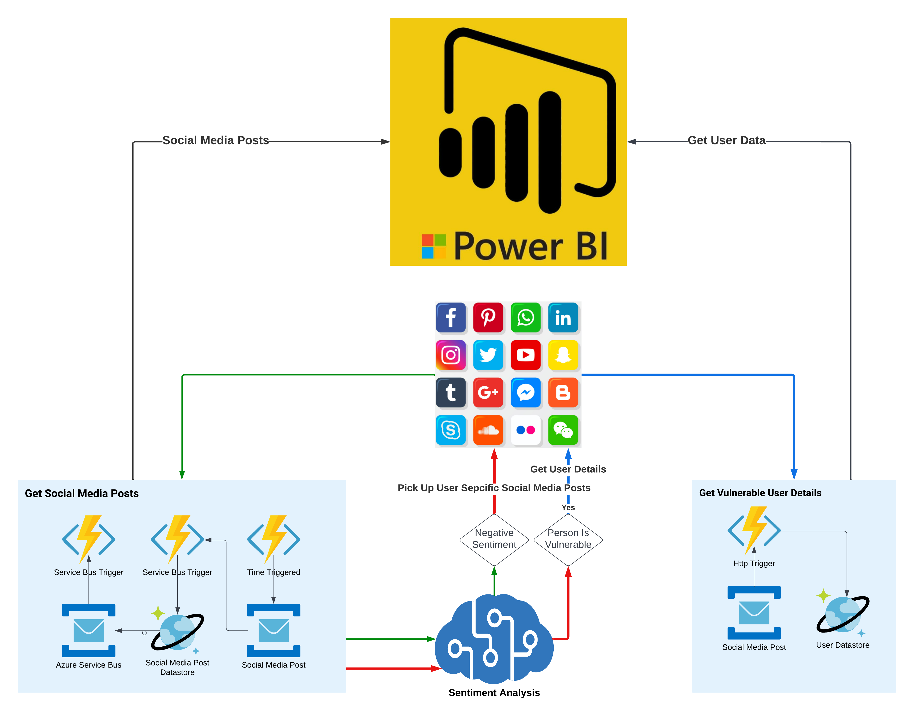

# Gun Threat Detection from Social Media: 

This repo contains the code related to leveraging AI for gun safety. 

### Background 

The Gun Violence Archive, a nonpartisan group tracking gun violence in the United Stated, defines a mass shooting as an incident in which four or more people are injured by gunfire, including the shooter [3]. As of September 21st, 2022, there have been 496 mass shootings in the US in 2022 alone. In previous years, there were roughly 691 mass shootings in 2021 and 610 in 2020 [4]. 48% of mass shooters share their plan of attack with others, such as family, friends, or the internet [2]. Before the mass shooting that took place in an elementary school in Uvalde, TX on May 24th, 2022, the shooter pinned photos of guns to his Instagram profile and wrote “Kids be scared” in his TikTok profile [5]. The assailant in the Parkland school shooting in 2018 also posted frequently about guns and gun violence on his Instagram account. In 2015, before the mass shooting at Umpqua Community College in Oregon, the shooter warned others on 4chan saying “Don’t go to school tomorrow if you are in the northwest” [6]. As social media has increased in popularity as a means of communication and connecting with others, it has also given criminals the ability to express their desire to harm others. Through the use of artificial intelligence, we hope to build software that can monitor social media sites, detect those that may pose a threat to others, and notify law enforcement in order to prevent those attacks. 
To maximize usefulness, the final project should be able to answer who is likely to commit a mass shooting, as well as where and when they will potentially strike. For the hackathon we’ll only focus on the “who”, but that also has many parts. There are many traits indicative of one who may be capable of attacking others in such a magnitude. These traits may include the following: 

- Inspiration by past shootings 

- A specific crisis or resentment 

- Trauma or exposure to violence at an early age 

- A method to attack 

## Architecture

The architecture consists of pulling twitter feeds by keywords such as violence, gun, shooting, killing etc by using Azure Function which runs every minute. The feeds are dumped in to a cosmos db through a service bus queue. Once the feeds are added, another azure
function pulls the feed and runs sentiment analysis on the twitter feed using Azure Congnitive Service. If the sentiment score is negative, the user information is pulled using twitter api and added to users table within cosmos db along with tweet text and sentitment score.
The power BI dashboard runs report based on the user data to further analysis any kind of malicious intent.

## Contributing

This project welcomes contributions and suggestions.  Most contributions require you to agree to a
Contributor License Agreement (CLA) declaring that you have the right to, and actually do, grant us
the rights to use your contribution. For details, visit https://cla.opensource.microsoft.com.

When you submit a pull request, a CLA bot will automatically determine whether you need to provide
a CLA and decorate the PR appropriately (e.g., status check, comment). Simply follow the instructions
provided by the bot. You will only need to do this once across all repos using our CLA.

This project has adopted the [Microsoft Open Source Code of Conduct](https://opensource.microsoft.com/codeofconduct/).
For more information see the [Code of Conduct FAQ](https://opensource.microsoft.com/codeofconduct/faq/) or
contact [opencode@microsoft.com](mailto:opencode@microsoft.com) with any additional questions or comments.

## Trademarks

This project may contain trademarks or logos for projects, products, or services. Authorized use of Microsoft 
trademarks or logos is subject to and must follow 
[Microsoft's Trademark & Brand Guidelines](https://www.microsoft.com/en-us/legal/intellectualproperty/trademarks/usage/general).
Use of Microsoft trademarks or logos in modified versions of this project must not cause confusion or imply Microsoft sponsorship.
Any use of third-party trademarks or logos are subject to those third-party's policies.
